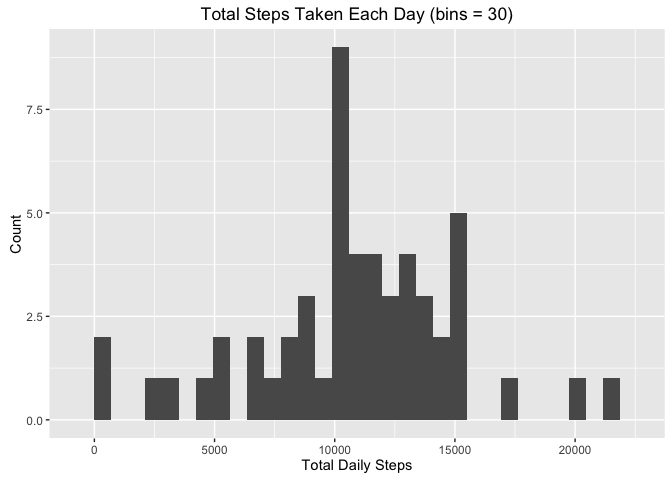
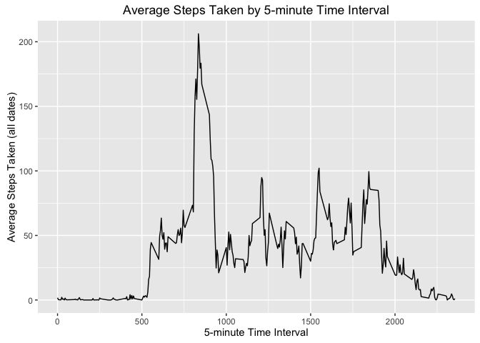
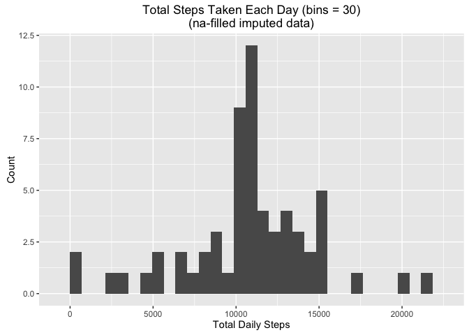
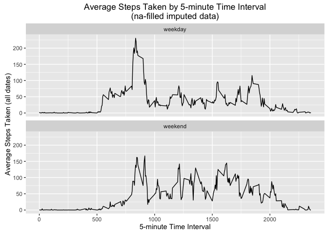

# Reproducible Research: Peer Assessment 1


## Loading and preprocessing the data

```r
#load libraries and set options
library(ggplot2)
library(dplyr)
options(dplyr.width = Inf, dplyr.print_max = 1000)

#load activity data
data <- read.csv(file = 'activity.csv')
```

## What is mean total number of steps taken per day?
#### 1. Calculate the total number of steps taken per day

```r
#calculate total number of steps taken each day
t1_steps_data <- data %>%
                     group_by(date) %>%
                     summarize(StepCount = sum(steps)) %>%
                     arrange(date)

#output
print(t1_steps_data)
```

```
Source: local data frame [61 x 2]

         date StepCount
       (fctr)     (int)
1  2012-10-01        NA
2  2012-10-02       126
3  2012-10-03     11352
4  2012-10-04     12116
5  2012-10-05     13294
6  2012-10-06     15420
7  2012-10-07     11015
8  2012-10-08        NA
9  2012-10-09     12811
10 2012-10-10      9900
11 2012-10-11     10304
12 2012-10-12     17382
13 2012-10-13     12426
14 2012-10-14     15098
15 2012-10-15     10139
16 2012-10-16     15084
17 2012-10-17     13452
18 2012-10-18     10056
19 2012-10-19     11829
20 2012-10-20     10395
21 2012-10-21      8821
22 2012-10-22     13460
23 2012-10-23      8918
24 2012-10-24      8355
25 2012-10-25      2492
26 2012-10-26      6778
27 2012-10-27     10119
28 2012-10-28     11458
29 2012-10-29      5018
30 2012-10-30      9819
31 2012-10-31     15414
32 2012-11-01        NA
33 2012-11-02     10600
34 2012-11-03     10571
35 2012-11-04        NA
36 2012-11-05     10439
37 2012-11-06      8334
38 2012-11-07     12883
39 2012-11-08      3219
40 2012-11-09        NA
41 2012-11-10        NA
42 2012-11-11     12608
43 2012-11-12     10765
44 2012-11-13      7336
45 2012-11-14        NA
46 2012-11-15        41
47 2012-11-16      5441
48 2012-11-17     14339
49 2012-11-18     15110
50 2012-11-19      8841
51 2012-11-20      4472
52 2012-11-21     12787
53 2012-11-22     20427
54 2012-11-23     21194
55 2012-11-24     14478
56 2012-11-25     11834
57 2012-11-26     11162
58 2012-11-27     13646
59 2012-11-28     10183
60 2012-11-29      7047
61 2012-11-30        NA
```

#### 2. Make a histogram of the total number of steps taken each day

```r
#plot histogram of total number of steps taken each day
g_plot <- ggplot(t1_steps_data,
                 aes(StepCount)
)

g_plot +
    geom_histogram() +
    labs(title = 'Total Steps Taken Each Day (bins = 30)',
         x = 'Total Daily Steps',
         y = 'Count'
    )
```

 

#### 3. Calculate and report the mean and median of the total number of steps taken per day

```r
#calculate mean and median of total number of steps taken each day
m1_steps_data <- data %>%
                     group_by(date) %>%
                     summarize(StepMean = mean(steps),
                               StepMedian = median(steps)
                     ) %>%
                     arrange(date)

#output    
print(m1_steps_data)
```

```
Source: local data frame [61 x 3]

         date   StepMean StepMedian
       (fctr)      (dbl)      (dbl)
1  2012-10-01         NA         NA
2  2012-10-02  0.4375000          0
3  2012-10-03 39.4166667          0
4  2012-10-04 42.0694444          0
5  2012-10-05 46.1597222          0
6  2012-10-06 53.5416667          0
7  2012-10-07 38.2465278          0
8  2012-10-08         NA         NA
9  2012-10-09 44.4826389          0
10 2012-10-10 34.3750000          0
11 2012-10-11 35.7777778          0
12 2012-10-12 60.3541667          0
13 2012-10-13 43.1458333          0
14 2012-10-14 52.4236111          0
15 2012-10-15 35.2048611          0
16 2012-10-16 52.3750000          0
17 2012-10-17 46.7083333          0
18 2012-10-18 34.9166667          0
19 2012-10-19 41.0729167          0
20 2012-10-20 36.0937500          0
21 2012-10-21 30.6284722          0
22 2012-10-22 46.7361111          0
23 2012-10-23 30.9652778          0
24 2012-10-24 29.0104167          0
25 2012-10-25  8.6527778          0
26 2012-10-26 23.5347222          0
27 2012-10-27 35.1354167          0
28 2012-10-28 39.7847222          0
29 2012-10-29 17.4236111          0
30 2012-10-30 34.0937500          0
31 2012-10-31 53.5208333          0
32 2012-11-01         NA         NA
33 2012-11-02 36.8055556          0
34 2012-11-03 36.7048611          0
35 2012-11-04         NA         NA
36 2012-11-05 36.2465278          0
37 2012-11-06 28.9375000          0
38 2012-11-07 44.7326389          0
39 2012-11-08 11.1770833          0
40 2012-11-09         NA         NA
41 2012-11-10         NA         NA
42 2012-11-11 43.7777778          0
43 2012-11-12 37.3784722          0
44 2012-11-13 25.4722222          0
45 2012-11-14         NA         NA
46 2012-11-15  0.1423611          0
47 2012-11-16 18.8923611          0
48 2012-11-17 49.7881944          0
49 2012-11-18 52.4652778          0
50 2012-11-19 30.6979167          0
51 2012-11-20 15.5277778          0
52 2012-11-21 44.3993056          0
53 2012-11-22 70.9270833          0
54 2012-11-23 73.5902778          0
55 2012-11-24 50.2708333          0
56 2012-11-25 41.0902778          0
57 2012-11-26 38.7569444          0
58 2012-11-27 47.3819444          0
59 2012-11-28 35.3576389          0
60 2012-11-29 24.4687500          0
61 2012-11-30         NA         NA
```

## What is the average daily activity pattern?
#### 1. Make a time series plot (i.e. 𝚝𝚢𝚙𝚎 = "𝚕") of the 5-minute interval (x-axis) and the average number of steps taken, averaged across all days (y-axis)

```r
#calculate average number of steps taken by 5-minute intervals average across all days
i1_steps_data <- data %>%
                     group_by(interval) %>%
                     summarize(StepMean = mean(steps, na.rm = TRUE)) %>%
                     arrange(interval)

#plot time-series 5-minute interval average steps taken
g_plot <- ggplot(i1_steps_data,
                 aes(x = interval,
                     y = StepMean)
)

g_plot +
    geom_line() +
    labs(title = 'Average Steps Taken by 5-minute Time Interval',
         x = '5-minute Time Interval',
         y = 'Average Steps Taken (all dates)'
    )
```

 

#### 2. Which 5-minute interval, on average across all the days in the dataset, contains the maximum number of steps?

```r
#5-minute interval with maximum number of steps
interval_max <- head(arrange(i1_steps_data, 
                             desc(StepMean)
                     ), 
                     n = 1
)

#output
print(paste('5-minute interval with max steps = ', 
            interval_max['interval'], 
            sep = ''
      )
)
```

```
[1] "5-minute interval with max steps = 835"
```

## Imputing missing values
#### 1. Calculate and report the total number of missing values in the dataset (i.e. the total number of rows with 𝙽𝙰s)

```r
#na count in complete data set
na_count <- count(data, is.na(steps))[2 ,2]
colnames(na_count) <- 'NaCount'

#output
print(paste('NA Count = ', na_count, sep = ''))
```

```
[1] "NA Count = 2304"
```

#### 2. Devise a strategy for filling in all of the missing values in the dataset.

```r
#replace na data with average steps by 5-minute interval (calculated in earlier step) rounded up to the nearest whole integer e.g. 1.717 average step rounded up to 2 steps
na_steps_data <- data %>%
                     filter(is.na(steps)) %>%
                     select(interval, date) %>%
                     inner_join(i1_steps_data, by = 'interval') %>%
                     mutate(steps = ceiling(StepMean)) %>%
                     select(date, interval, steps)
```

#### 3. Create a new dataset that is equal to the original dataset but with the missing data filled in.

```r
#remove na records from original data set
nona_steps_data <- data %>%
                       filter(!is.na(steps)) %>%
                       select(date, interval, steps)

#combine na imputed data with non-na data
imp_steps_data <- rbind(nona_steps_data, na_steps_data)
```

#### 4a. Make a histogram of the total number of steps taken each day (na-filled imputed data)

```r
#calculate total number of steps taken each day (using imputed data)
t2_steps_data <- imp_steps_data %>%
                     group_by(date) %>%
                     summarize(StepCount = sum(steps)) %>%
                     arrange(date)

#plot histogram of total number of steps taken each day
g_plot <- ggplot(t2_steps_data,
                 aes(StepCount)
)

g_plot +
    geom_histogram() +
    labs(title = 'Total Steps Taken Each Day (bins = 30)\n(na-filled imputed data)',
         x = 'Total Daily Steps',
         y = 'Count'
    )
```

 

#### 4b. Calculate and report the mean and median total number of steps taken per day. (na-filled imputed data)

```r
#calculate mean and median of total number of steps taken each day
m2_steps_data <- imp_steps_data %>%
                     group_by(date) %>%
                     summarize(StepMean = mean(steps),
                               StepMedian = median(steps)
                     ) %>%
                     arrange(date)

#output    
print(m2_steps_data)
```

```
Source: local data frame [61 x 3]

         date   StepMean StepMedian
       (fctr)      (dbl)      (dbl)
1  2012-10-01 37.8784722       34.5
2  2012-10-02  0.4375000        0.0
3  2012-10-03 39.4166667        0.0
4  2012-10-04 42.0694444        0.0
5  2012-10-05 46.1597222        0.0
6  2012-10-06 53.5416667        0.0
7  2012-10-07 38.2465278        0.0
8  2012-10-08 37.8784722       34.5
9  2012-10-09 44.4826389        0.0
10 2012-10-10 34.3750000        0.0
11 2012-10-11 35.7777778        0.0
12 2012-10-12 60.3541667        0.0
13 2012-10-13 43.1458333        0.0
14 2012-10-14 52.4236111        0.0
15 2012-10-15 35.2048611        0.0
16 2012-10-16 52.3750000        0.0
17 2012-10-17 46.7083333        0.0
18 2012-10-18 34.9166667        0.0
19 2012-10-19 41.0729167        0.0
20 2012-10-20 36.0937500        0.0
21 2012-10-21 30.6284722        0.0
22 2012-10-22 46.7361111        0.0
23 2012-10-23 30.9652778        0.0
24 2012-10-24 29.0104167        0.0
25 2012-10-25  8.6527778        0.0
26 2012-10-26 23.5347222        0.0
27 2012-10-27 35.1354167        0.0
28 2012-10-28 39.7847222        0.0
29 2012-10-29 17.4236111        0.0
30 2012-10-30 34.0937500        0.0
31 2012-10-31 53.5208333        0.0
32 2012-11-01 37.8784722       34.5
33 2012-11-02 36.8055556        0.0
34 2012-11-03 36.7048611        0.0
35 2012-11-04 37.8784722       34.5
36 2012-11-05 36.2465278        0.0
37 2012-11-06 28.9375000        0.0
38 2012-11-07 44.7326389        0.0
39 2012-11-08 11.1770833        0.0
40 2012-11-09 37.8784722       34.5
41 2012-11-10 37.8784722       34.5
42 2012-11-11 43.7777778        0.0
43 2012-11-12 37.3784722        0.0
44 2012-11-13 25.4722222        0.0
45 2012-11-14 37.8784722       34.5
46 2012-11-15  0.1423611        0.0
47 2012-11-16 18.8923611        0.0
48 2012-11-17 49.7881944        0.0
49 2012-11-18 52.4652778        0.0
50 2012-11-19 30.6979167        0.0
51 2012-11-20 15.5277778        0.0
52 2012-11-21 44.3993056        0.0
53 2012-11-22 70.9270833        0.0
54 2012-11-23 73.5902778        0.0
55 2012-11-24 50.2708333        0.0
56 2012-11-25 41.0902778        0.0
57 2012-11-26 38.7569444        0.0
58 2012-11-27 47.3819444        0.0
59 2012-11-28 35.3576389        0.0
60 2012-11-29 24.4687500        0.0
61 2012-11-30 37.8784722       34.5
```

## Are there differences in activity patterns between weekdays and weekends?
#### 1. Create a new factor variable in the dataset with two levels – “weekday” and “weekend” indicating whether a given date is a weekday or weekend day. (na-filled imputed data)

```r
#create new data set from imputed filled-in missing values with weekend or weekday flag
w_steps_data <- imp_steps_data %>%
                    mutate(DayType = ifelse(weekdays(as.Date(date)) 
                                                %in% c('Saturday', 'Sunday'),
                                            'weekend',
                                            'weekday'
                                     )
                    )
```

#### 2. Make a panel plot containing a time series plot (i.e. 𝚝𝚢𝚙𝚎 = "𝚕") of the 5-minute interval (x-axis) and the average number of steps taken, averaged across all weekday days or weekend days (y-axis) (na-filled imputed data)

```r
#calculate average number of steps taken by 5-minute intervals average across all days
i2_steps_data <- w_steps_data %>%
                     group_by(interval, DayType) %>%
                     summarize(StepMean = mean(steps, na.rm = TRUE)) %>%
                     arrange(DayType, interval)

#plot time-series 5-minute interval average steps taken
g_plot <- ggplot(i2_steps_data,
                 aes(x = interval,
                     y = StepMean)
)

g_plot +
    geom_line() +
    facet_wrap(~ DayType, ncol = 1) +
    labs(title = 'Average Steps Taken by 5-minute Time Interval\n(na-filled imputed data)',
         x = '5-minute Time Interval',
         y = 'Average Steps Taken (all dates)'
    )
```

 
